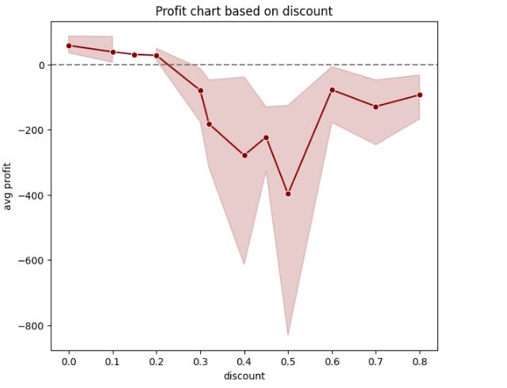
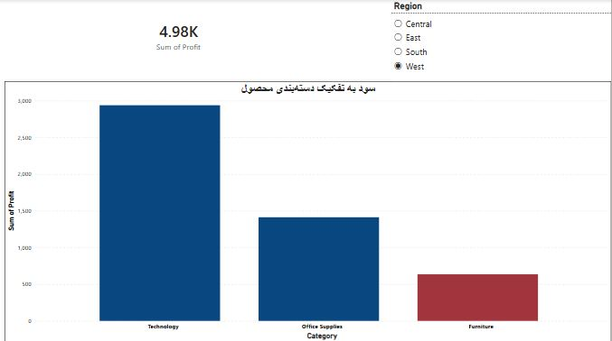

# تحلیل سودآوری فروشگاه Superstore

تحلیل داده‌ی فروش یک فروشگاه زنجیره‌ای برای شناسایی عامل اصلی افت سودآوری.

## ابزارها
Python, Pandas, Seaborn, Matplotlib

## سوال تحلیل
کدام بخش از کسب‌وکار باعث افت سودآوری می‌شود؟

## یافته‌ی کلیدی
دسته‌ی **مبلمان (Furniture)** تنها دسته‌ای است که به‌طور میانگین ضرر تولید می‌کند، در حالی که دو دسته‌ی دیگر (Office Supplies و Technology) سودآور هستند.

## علت
بررسی داده نشان داد دسته‌ی مبلمان میانگین تخفیف بالاتری (۲۱.۳٪) نسبت به سایر دسته‌ها دریافت می‌کند. تحلیل کلی‌تر داده هم نشان داد هر سفارشی با تخفیف بالای ۳۰٪ — صرف‌نظر از دسته‌بندی — تقریباً همیشه با ضرر همراه است.

## اثر مالی
۲۸ سفارش مبلمان با تخفیف بالای ۲۰٪ ثبت شده که مجموعاً **۵,۲۰۷ دلار ضرر مستقیم** به فروشگاه تحمیل کرده‌اند.

## نمودار
میانگین سود بر اساس درصد تخفیف — نقطه‌ی بحرانی دقیقاً حوالی تخفیف ۲۰-۳۰٪ قابل مشاهده است.

## پیشنهاد
سقف تخفیف دسته‌ی مبلمان به حداکثر ۲۰٪ محدود شود تا از ضرر مستمر در این دسته جلوگیری شود.
دیتاست خام
## داشبورد Power BI
یک داشبورد تعاملی با نمودار سود بر اساس دسته‌بندی، فیلتر منطقه‌ای، و کارت مجموع سود کل ساخته شد.

## فایل‌ها
- `superstore_analysis.ipynb` — کد اصلی تحلیل (Pandas + Seaborn)
- `sql_pandas_practice.ipynb` — تمرین مقایسه‌ای SQL و Pandas (JOIN, CASE WHEN, HAVING, GROUP BY, pivot_table) روی همین دیتاست
- `superstore.csv` — دیتاست خام
- `powerbi_dashboard.png` — اسکرین‌شات داشبورد Power BI
